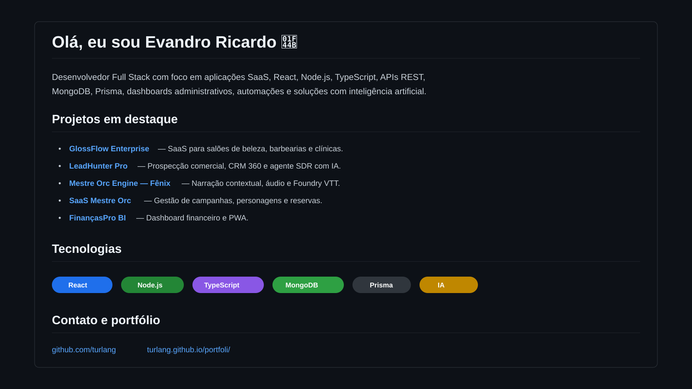

# Olá, eu sou Evandro Ricardo 👋

Desenvolvedor Full Stack com foco em aplicações SaaS, React, Node.js, TypeScript, APIs REST, MongoDB, Prisma, dashboards administrativos, automações e soluções com inteligência artificial.

## Projetos em destaque

- **GlossFlow Enterprise** — SaaS para salões de beleza, barbearias e clínicas de estética.
- **LeadHunter Pro** — Prospecção comercial, CRM 360 e agente SDR com IA.
- **Mestre Orc Engine — Fênix** — Narração contextual, áudio e integração com Foundry VTT.
- **SaaS Mestre Orc** — Gestão de campanhas, personagens, reservas e exportações.
- **FinançasPro BI** — Dashboard financeiro e PWA para orçamento pessoal.
- **DevClub Level Up** — Experiência institucional gamificada.

## Tecnologias

`React` · `JavaScript` · `TypeScript` · `Node.js` · `Express` · `Fastify` · `MongoDB` · `Prisma` · `APIs REST` · `IA` · `PWA` · `GitHub Actions`

## Perfil profissional

Construo produtos digitais voltados a problemas reais, combinando experiência do usuário, regras de negócio, arquitetura organizada, documentação e evolução contínua.
